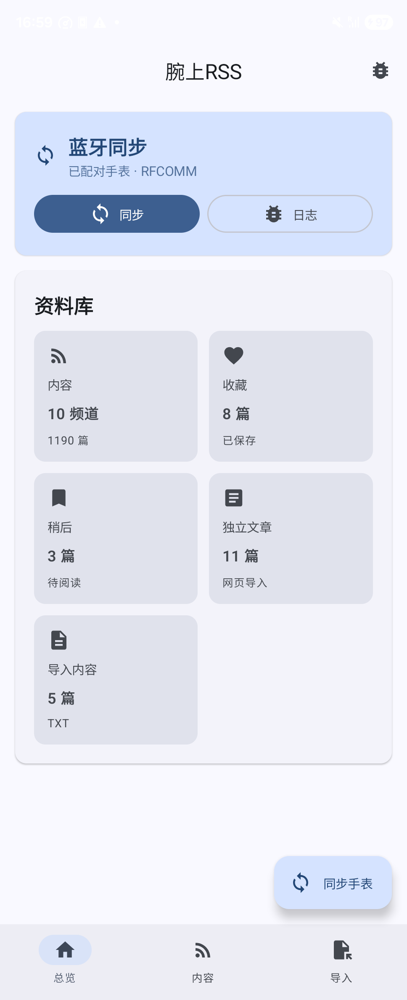
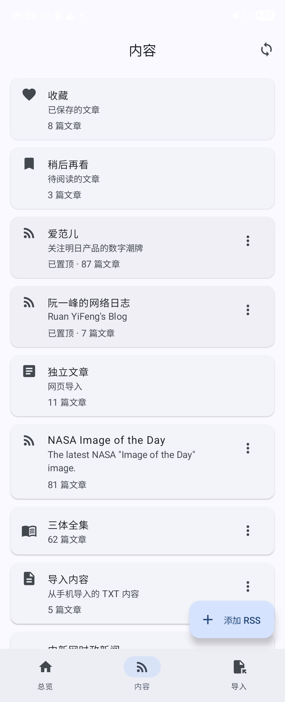
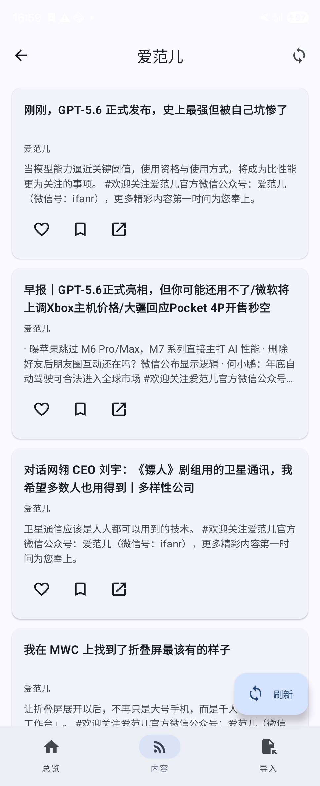
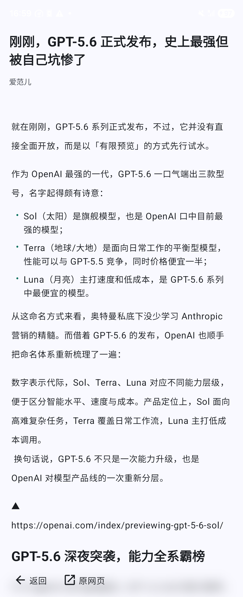
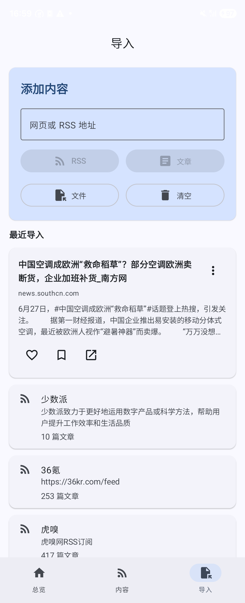
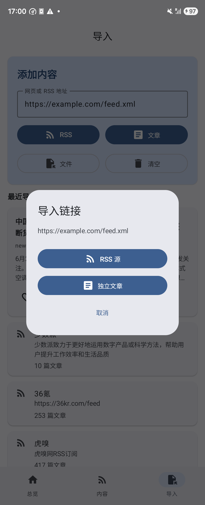

\newpage

# 一、软件概述

腕上RSS手机端是配合 OPPO Watch 端腕上RSS阅读器使用的 Android 伴侣应用。用户可以在手机上管理 RSS 订阅源、导入网页文章、导入 TXT 或 EPUB 本地内容，并通过已配对蓝牙与手表执行一次性双向同步。

手机端应用以“总览、内容、导入”三栏为主要导航结构：

- “总览”用于查看蓝牙同步状态、资料库统计，并快速进入内容、收藏、稍后再看、独立文章和导入内容。
- “内容”用于管理收藏、稍后再看、RSS 频道、独立文章、TXT 导入内容和 EPUB 导入频道。
- “导入”用于添加 RSS 源、导入网页文章、选择本地 TXT/EPUB 文件，以及处理来自浏览器或文件管理器的分享内容。

应用正式连接方式为 Android 公开蓝牙 RFCOMM。手机与手表需要先在系统蓝牙中完成配对，手表端打开腕上RSS并保持亮屏后，手机端点击同步按钮即可执行一次资料库交换。应用不需要 OPPO 或 HeyTap 闭源 SDK。

本文截图取自一台三星测试手机，截图中的频道名称、文章标题和文章数量仅用于展示界面效果，实际内容会随用户本机资料库变化。

## 1.1 软件信息

| 项目 | 内容 |
| --- | --- |
| 软件名称 | 腕上RSS手机端 |
| Android 包名 | `com.lightningstudio.watchrss.phone` |
| 当前版本 | `1.0.0-2` |
| Version Code | `13` |
| 最低系统版本 | Android 11，API 30 |
| 目标系统版本 | Android API 36 |
| 主要通信方式 | 已配对蓝牙 RFCOMM |
| 主要数据类型 | RSS 源、文章、收藏、稍后再看、独立文章、TXT/EPUB 导入内容 |

## 1.2 权限和网络要求

应用主要使用以下权限和能力：

- 网络访问：用于抓取 RSS 源、网页正文、文章图片和平台网页。
- 蓝牙连接：Android 12 及以上系统同步手表时需要授予“附近设备/蓝牙连接”权限。
- 文件访问：用户主动选择 TXT 或 EPUB 文件时，应用读取所选文件内容。

应用的蓝牙同步是一次短连接操作。同步完成或失败后，本次 RFCOMM 会话结束，用户可按需再次点击同步。

\newpage

# 二、首页总览

打开应用后进入“总览”页面。页面顶部显示应用名称“腕上RSS”，右上角提供蓝牙日志导出入口。中部“蓝牙同步”卡片显示当前同步方式为“已配对手表 · RFCOMM”，并提供“同步”和“日志”按钮。下方“资料库”区域展示当前本机资料库统计，包括内容频道、收藏、稍后、独立文章和导入内容。

{ width=45% }

首页主要控件说明：

- “同步”：立即探测已配对并已打开腕上RSS的手表，执行一次资料库双向同步。
- “日志”：导出手机端蓝牙同步日志，用于排查连接或传输问题。
- “内容”：进入频道和文章管理页面。
- “收藏”：查看已收藏文章。
- “稍后”：查看稍后再看的文章。
- “独立文章”：查看通过网页地址单独导入的文章。
- “导入内容”：查看 TXT 文件导入后的本地文章。
- 底部导航“总览、内容、导入”：在三个主页面之间切换。

首次同步前，请确认手机和手表已经在系统蓝牙设置中完成配对，并在手表端打开腕上RSS应用。

\newpage

# 三、内容管理

点击底部“内容”进入内容管理页。该页面按卡片列出收藏、稍后再看、置顶频道、普通 RSS 频道、独立文章、EPUB 导入频道和 TXT 导入内容。

{ width=45% }

内容页支持以下操作：

- 点击“收藏”或“稍后再看”卡片，查看对应保存列表。
- 点击任一 RSS 频道卡片，进入该频道文章列表。
- 点击右上角刷新按钮或下拉刷新，刷新所有普通 RSS 源。
- 点击频道右侧菜单，可对频道执行“移到顶部”“置顶/取消置顶”“删除”等操作。
- 置顶频道会显示在普通频道前方。
- “独立文章”卡片收纳从网页地址单独导入的文章。
- “导入内容”卡片收纳 TXT 文件导入后的本地文章。
- EPUB 文件会作为独立本地频道显示在内容列表中。

删除普通 RSS 频道会移除该频道入口；删除本地导入频道时，应用会同步标记该频道下的本地文章为已删除。删除操作会参与后续蓝牙同步，手表端会在同步后收到对应变化。

\newpage

# 四、频道文章列表

在内容页点击一个频道后，应用进入该频道文章列表。列表顶部显示频道名称，右上角提供刷新当前频道按钮。每篇文章以卡片形式展示标题、来源和摘要。

{ width=45% }

文章卡片支持以下操作：

- 点击文章卡片：进入文章阅读页。
- 点击心形按钮：收藏或取消收藏该文章。
- 点击书签按钮：加入或移出稍后再看。
- 点击外链按钮：打开原网页。
- 长按可删除的本地文章或独立文章：显示删除操作。
- 点击左上角返回按钮：回到内容列表。

收藏和稍后再看的状态会保存在手机本地资料库中，并在下次蓝牙同步时与手表端交换。对于普通 RSS 文章，应用会保留文章源信息；对于本地导入文章，应用会在本地资料库中保存正文或正文索引。

\newpage

# 五、文章阅读

点击文章后进入阅读页。阅读页显示文章标题、来源、正文内容和底部操作栏。用户可以阅读文章正文、返回列表，或打开原网页。

{ width=45% }

阅读页主要操作：

- “返回”：退出当前文章，回到上一级文章列表。
- “原网页”：用浏览器或平台网页打开原始链接。
- 上下滑动：阅读完整正文。
- 自动记录阅读进度：退出文章后再次打开时，应用会尽量恢复阅读位置。

当文章链接属于受支持的平台链接时，应用可使用内置平台 WebView 打开网页，提供返回、外部打开、上一页和全屏等网页浏览操作；其他普通链接可通过系统浏览器打开。

\newpage

# 六、添加和导入内容

点击底部“导入”进入添加内容页面。该页面提供一个地址输入框和四个操作按钮：“RSS”“文章”“文件”“清空”。

{ width=45% }

## 6.1 添加 RSS 源

1. 点击底部“导入”。
2. 在“网页或 RSS 地址”输入框中输入 RSS 源地址。
3. 点击“RSS”按钮。
4. 应用抓取 RSS 源信息，并将源添加到内容页。
5. 添加成功后，频道会出现在“内容”页面，文章会进入该频道文章列表。

如果输入地址不是可解析的 RSS 源，应用会显示错误信息。用户可检查地址是否完整，或确认网络连接是否正常。

## 6.2 添加独立网页文章

1. 点击底部“导入”。
2. 在“网页或 RSS 地址”输入框中输入网页文章地址。
3. 点击“文章”按钮。
4. 应用抓取网页并提取正文。
5. 导入成功后，文章会出现在“独立文章”和“最近导入”列表中。

独立文章适合保存单篇网页内容，不需要把整个 RSS 源加入频道列表。

## 6.3 导入 TXT 或 EPUB 文件

1. 点击底部“导入”。
2. 点击“文件”按钮。
3. 在系统文件选择器中选择 TXT 或 EPUB 文件。
4. 应用读取文件并生成可阅读文章。

TXT 文件会进入“导入内容”频道。EPUB 文件会作为一个独立本地频道显示在“内容”页中，并按章节生成文章列表。当前版本仅支持 TXT 和 EPUB 文件，不支持任意格式文件导入。

## 6.4 清空导入内容

“清空”按钮用于清理 TXT 根频道“导入内容”中的本地文章。EPUB 导入频道和 RSS 频道可在“内容”页通过频道菜单删除。

\newpage

# 七、外部分享导入

用户也可以从浏览器、阅读应用或文件管理器把链接或文件分享到腕上RSS。应用收到链接后，会弹出“导入链接”对话框，让用户选择将该链接作为 RSS 源或独立文章导入。

{ width=45% }

链接分享操作步骤：

1. 在浏览器或其他应用中打开目标网页。
2. 点击系统分享按钮。
3. 在分享目标中选择“腕上RSS”。
4. 在弹窗中选择“RSS 源”或“独立文章”。
5. 等待应用完成导入。

文件分享操作步骤：

1. 在文件管理器中选择 TXT 或 EPUB 文件。
2. 点击分享或用其他应用打开。
3. 选择“腕上RSS”。
4. 在导入文件弹窗中确认导入。
5. 导入完成后，在“内容”或“导入”页面查看结果。

分享导入不会自动判断用户意图。对于同一个链接，用户需要明确选择“RSS 源”或“独立文章”。

\newpage

# 八、蓝牙同步手表

蓝牙同步用于在手机和手表之间交换资料库。同步内容包括 RSS 源、文章状态、收藏、稍后再看、独立文章和本地导入内容。

同步前准备：

1. 在手机系统蓝牙设置中与手表完成配对。
2. 在手表上安装并打开腕上RSS。
3. 保持手表亮屏，并进入可接收手机同步的状态。
4. 在手机端打开腕上RSS。
5. 如系统提示蓝牙连接权限，选择允许。

同步操作：

1. 在“总览”页点击“同步”按钮，或点击右下角“同步手表”浮动按钮。
2. 手机开始探测已配对并已打开腕上RSS的手表。
3. 如检测到多块手表，选择本次同步目标。
4. 等待“建立连接中”“信息传输中”“校验中”等进度完成。
5. 同步完成后，应用显示完成提示。

同步冲突处理：

- 如果手机端和手表端对同一内容存在删除或保留冲突，应用会弹出处理对话框。
- 用户可选择“保留最新操作”“合并内容”“删除内容”或进入手动选择。
- 手动选择中可保留手表版本、保留手机版本或删除。

蓝牙同步不是常驻连接。每次点击同步都会建立一次短连接，请在需要更新数据时手动执行。

# 九、日志导出和问题排查

首页“蓝牙同步”卡片和右上角图标提供日志导出能力。用户遇到同步失败、传输中断或无法找到手表时，可点击“日志”，选择保存位置，导出手机端蓝牙日志。

常见问题处理：

| 问题 | 处理方法 |
| --- | --- |
| 找不到手表 | 确认手机和手表已系统配对；手表端腕上RSS已打开；手表保持亮屏；再点击同步 |
| 系统提示蓝牙权限 | 允许“附近设备”或“蓝牙连接”权限 |
| RSS 添加失败 | 检查 RSS 地址是否完整，确认手机网络可用 |
| 网页文章导入失败 | 检查网页是否需要登录、是否禁止抓取，或改用分享到系统浏览器打开 |
| 文件导入失败 | 确认文件为 TXT 或 EPUB，且文件内容不为空 |
| 同步过程出现冲突 | 按弹窗选择保留最新、合并、删除或手动选择 |
| 平台网页无法打开 | 点击“原网页”使用系统浏览器打开 |

# 十、退出和数据管理

应用数据存储在手机本地数据库中。用户可通过以下方式管理数据：

- 在内容页删除 RSS 频道或本地导入频道。
- 在导入页点击“清空”清理 TXT 导入内容。
- 在文章列表中取消收藏或移出稍后再看。
- 在系统设置中清除应用数据或卸载应用，以清除本机全部资料库。

清除或删除后的状态会在下次蓝牙同步时参与双端合并。用户在执行大量删除操作后，建议及时与手表同步一次，确保双端状态一致。

# 十一、附录：本次说明书截图清单

| 编号 | 文件 | 说明 |
| --- | --- | --- |
| 图 1 | `screenshots/01_dashboard.png` | 首页总览与蓝牙同步 |
| 图 2 | `screenshots/02_content.png` | 内容频道列表 |
| 图 3 | `screenshots/03_channel_articles.png` | 频道文章列表 |
| 图 4 | `screenshots/04_article_reader.png` | 文章阅读页 |
| 图 5 | `screenshots/05_imports.png` | 添加和导入页面 |
| 图 6 | `screenshots/06_shared_link_import.png` | 分享链接导入弹窗 |

